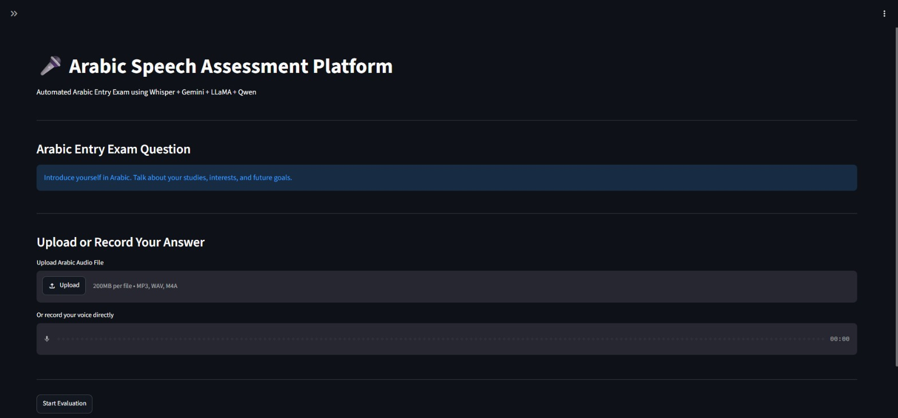
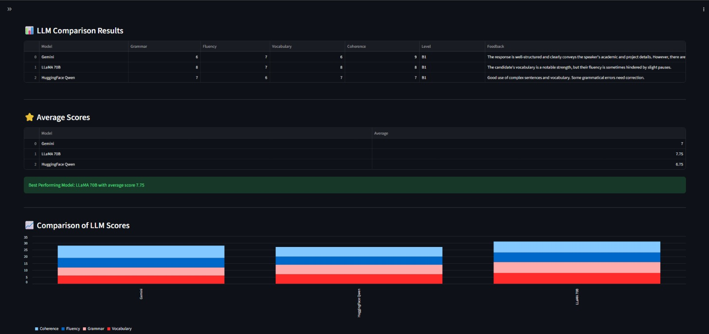

# Arabic Speech Assessment Platform 🎤

An AI-powered platform for assessing Arabic speech responses using Speech Recognition and Large Language Models (LLMs).

## Overview

This project evaluates spoken Arabic responses by converting speech to text and analyzing the content using multiple AI models. The platform provides automated assessment and feedback based on grammar, fluency, vocabulary, and coherence.

## Features

* Speech-to-Text conversion using Whisper
* Arabic speech assessment
* Grammar evaluation
* Fluency evaluation
* Vocabulary evaluation
* Coherence evaluation
* Comparison between multiple LLMs
* Interactive web interface using Streamlit

## Technologies Used

* Python
* Streamlit
* Whisper
* Gemini
* LLaMA 70B
* Qwen
* Natural Language Processing (NLP)

## Screenshots

### Home Page

### Assessment Results

## Workflow

1. Upload or record an Arabic speech response.
2. Convert speech to text using Whisper.
3. Analyze the response using multiple LLMs.
4. Generate assessment scores and feedback.
5. Compare model outputs and display results.

## Project Objectives

* Automate Arabic speech assessment.
* Compare the performance of different Large Language Models.
* Provide meaningful feedback for spoken responses.
* Explore the integration of Speech Recognition and NLP technologies.

## Project Highlights

- Automated Arabic Speech Assessment
- Speech-to-Text using Whisper
- LLM-based Evaluation (Gemini, LLaMA 70B, Qwen)
- Interactive Streamlit Dashboard
- Comparative Analysis of Model Performance

## Author

Sahel Halwani
Data Science Graduate – Umm Al-Qura University
